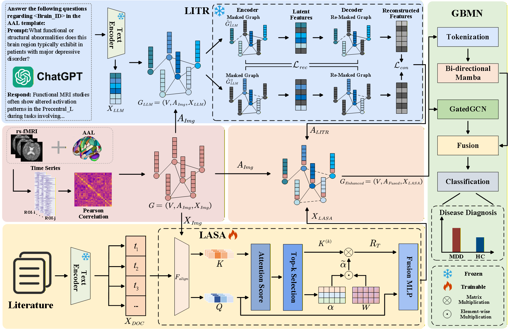

# IEBGL
[CVPR 2026] IEBGL:An Interpretability-Enhanced Brain Graph Learning Framework with LLM-Instructed Topology and Literature-Augmented Semantics

## abstract
Resting-state functional MRI (rs-fMRI) provides rich information for modeling brain connectivity in disease diagnosis. However, most existing brain graph learning methods rely solely on imaging data, leading to limited biological interpretability and poor integration of external medical knowledge. To address these challenges, we propose an Interpretability-Enhanced Brain Graph Learning (IEBGL) framework that anchors brain network modeling in large-scale medical knowledge. Our framework introduces two complementary modules: LLM-Instructed Topological Reconstruction (LITR) and Literature-Augmented Semantic Aggregation (LASA). LITR employs large language model (LLM) reasoning to refine brain connectivity and construct topological structure. LASA augments node representations by aggregating  semantic information from biomedical literature, ensuring the model’s interpretability and relevance to clinical disease knowledge. Finally, the framework is trained with the Graph Bi-directional Mamba Network (GBMN) for disease diagnosis. Extensive experiments on the REST-meta-MDD and ABIDE datasets, together with 35,133 depression-related and 32,617 autism-related publications, demonstrate that IEBGL outperforms state-of-the-art methods in classification performance. Further analyses show that the LITR module reveals biologically meaningful alterations in brain connectivity, while the LASA module establishes interpretable associations between these regions and disease-related biomedical literature. Together, these mechanisms help IEBGL explain abnormal brain connections and their links to disease-related knowledge.

